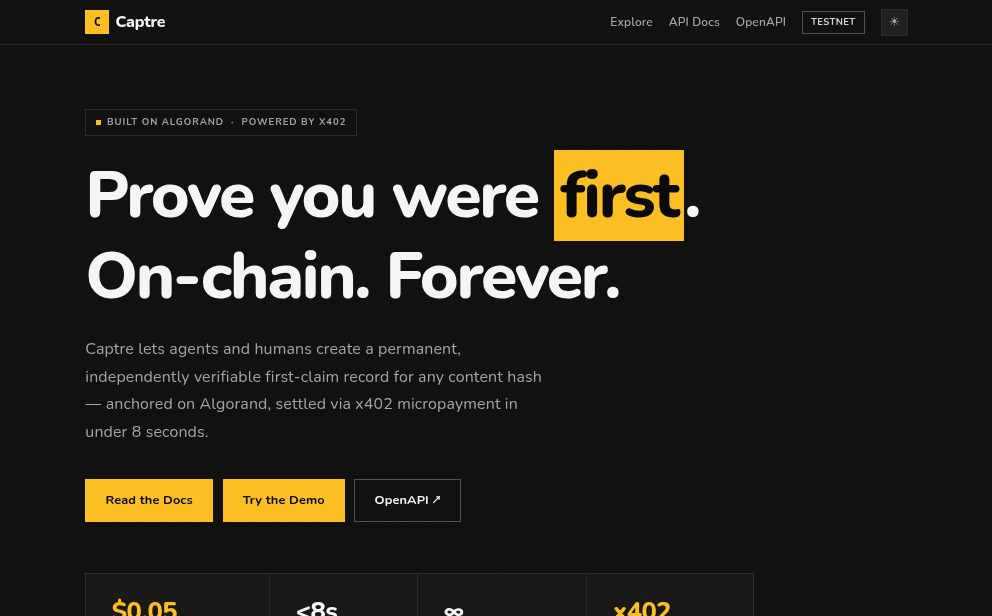
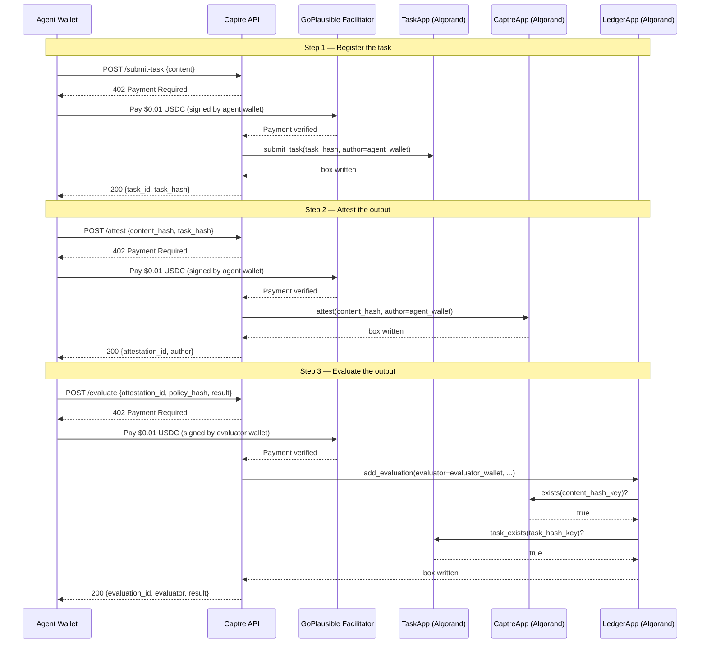

# Captre

**On-chain provenance ledger for AI agents — anchored on Algorand, paid via x402.**

---

## The Problem

AI agents produce outputs — summaries, decisions, code, reports. Right now there is no way to prove:

- **When** an output was produced
- **Which** agent produced it
- **Whether** it was independently evaluated
- **Who** the evaluator was and **what rules** they used

Anyone can claim anything after the fact. Logs can be faked. Timestamps can be altered.

---

## What Captre Does

Captre creates an **immutable, time-stamped chain of proof on Algorand** — a public blockchain — that no one can alter or fake:

**Step 1 — Task registered**
Proves the task existed *before* the output was produced. The agent's wallet is the proof of identity.

**Step 2 — Output attested**
Proves the output was produced and claimed by a specific agent wallet at a specific time. First-claim only — you cannot claim the same output twice, even after revocation.

**Step 3 — Evaluation recorded**
Proves an independent evaluator reviewed the output under a specific policy, and what they decided. The evaluator's wallet is their identity — they cannot deny it later.

```
Agent submits task      →  TaskApp stores task hash + agent wallet address
Agent produces output   →  CaptreApp stores content hash + agent wallet address
Evaluator evaluates     →  LedgerApp verifies both above exist on-chain,
                           then stores: evaluator + policy hash + result + score
```

**The key:** Identity is proven by **who paid** — not by what anyone claims. You cannot fake a wallet signature on a blockchain payment. That is what x402 brings — payment and identity in one step.

---

## Why This Matters

- **AI governance** — regulators and auditors can verify what an agent did, when, and whether it passed evaluation — without trusting anyone's word
- **Agent marketplaces** — buyers can verify an agent's track record is real, not fabricated
- **Liability** — when an AI makes a bad decision, you can trace exactly who submitted the task, who produced the output, and who signed off on it
- **Interoperability** — any x402-capable agent framework can call these endpoints — no SDK required

---

## The Three Contracts (Mainnet)

| Contract | App ID | Purpose |
|---|---|---|
| CaptreApp | `3682418169` | Stores attestations — first-claim content hash registry |
| TaskApp | `3709725780` | Stores task registrations — proves task existed before output |
| LedgerApp | `3709726556` | Stores evaluations — cross-calls both above to verify chain |

---

## API

| Method | Path | Cost | Description |
|--------|------|------|-------------|
| `POST` | `/submit-task` | `$0.01` USDC | Register a task on-chain |
| `POST` | `/attest` | `$0.01` USDC | Attest an output (first-claim) |
| `POST` | `/evaluate` | `$0.01` USDC | Record an evaluation of an attestation |
| `POST` | `/revoke` | `$0.01` USDC | Revoke an attestation (original author only) |
| `GET` | `/task/{id}` | free | Retrieve a task record |
| `GET` | `/verify?content_hash=…` | free | Verify by content hash |
| `GET` | `/attestation/{id}` | free | Retrieve an attestation |
| `GET` | `/evaluation/{id}` | free | Retrieve an evaluation |
| `GET` | `/attestations` | free | List all attestations |
| `GET` | `/health` | free | Liveness check |

All prices are set via environment variables. See [SETUP.md](SETUP.md) for full configuration.

### Examples

Register a task:
```bash
curl -X POST https://captre.onrender.com/submit-task \
  -H "Content-Type: application/json" \
  -d '{"content": "Summarise the Algorand whitepaper", "agent_id": "my-agent-v1"}'
```

Attest an output:
```bash
curl -X POST https://captre.onrender.com/attest \
  -H "Content-Type: application/json" \
  -d '{"content_hash": "sha256:<your-hash>", "output_type": "research", "description": "Summary of Algorand whitepaper"}'
```

Evaluate an attestation:
```bash
curl -X POST https://captre.onrender.com/evaluate \
  -H "Content-Type: application/json" \
  -d '{"output_attestation_id": "<attestation_id>", "content_hash": "sha256:<your-hash>", "policy_hash": "sha256:<64-hex-chars>", "evaluation_result": "pass", "score": 0.95}'
```

Verify for free (no payment needed):
```bash
curl "https://captre.onrender.com/verify?content_hash=sha256:<your-hash>"
curl "https://captre.onrender.com/attestation/<attestation_id>"
curl "https://captre.onrender.com/evaluation/<evaluation_id>"
```

> All paid endpoints return `402 Payment Required` first. An x402-capable client handles the payment automatically. See [GoPlausible x402 docs](https://facilitator.goplausible.xyz) for client libraries.

---

## Full Flow



**Identity is proven by who signs the payment** — `author` and `evaluator` come from the x402 payment transaction, not from anything in the request body. They cannot be spoofed.

---

## What Gets Stored On-Chain

Every record is written as a JSON blob to Algorand Box Storage — publicly readable, permanently immutable.

| Contract | Box key | What is stored |
|---|---|---|
| **TaskApp** | `sha256(task_hash)` — 32 bytes | `task_id`, `author` (wallet), `task_hash`, `created_at`, `tx_id`, optional `agent_id`/`tags` |
| **CaptreApp** | `sha256(content_hash)` — 32 bytes | `attestation_id`, `author` (wallet), `content_hash`, `status`, `created_at`, `tx_id`, optional `description`/`model`/`tags` |
| **CaptreApp** | `attestation_id` UUID | Index mapping UUID → `content_hash` (enables lookup by ID) |
| **LedgerApp** | `sha256(evaluation_id)` — 32 bytes | `evaluation_id`, `evaluator` (wallet), `policy_hash`, `evaluation_result`, `score`, `content_hash`, `task_hash`, `created_at`, `tx_id` |

Box names stay within Algorand's 64-byte limit. All records are written atomically — either the full record lands on-chain or nothing does. No partial writes.

---

## Built With

| Layer | Technology |
|---|---|
| Smart contracts | [Algorand Python](https://algorandfoundation.github.io/puya/) (AlgoKit / Puya) |
| Contract interaction | [algokit-utils](https://github.com/algorandfoundation/algokit-utils-py) |
| API server | [FastAPI](https://fastapi.tiangolo.com/) + [uvicorn](https://www.uvicorn.org/) |
| Payments | [x402-avm](https://github.com/goplausible/x402-avm) — x402 protocol over Algorand USDC |
| Payment facilitator | [GoPlausible](https://facilitator.goplausible.xyz) |
| Package manager | [uv](https://docs.astral.sh/uv/) |
| Hosting | [Render](https://render.com) |

---

## Live Demo

**https://captre.onrender.com** · API docs: **/api-reference** · OpenAPI: **/docs**

---

## Quick Start

See **[SETUP.md](SETUP.md)** for full setup — local testnet, mainnet production, and all environment variables.
